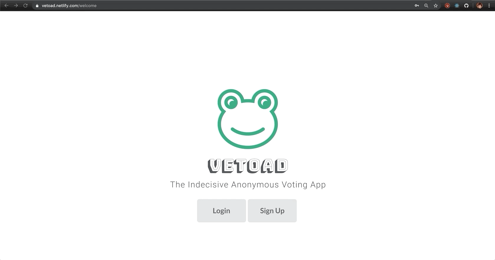
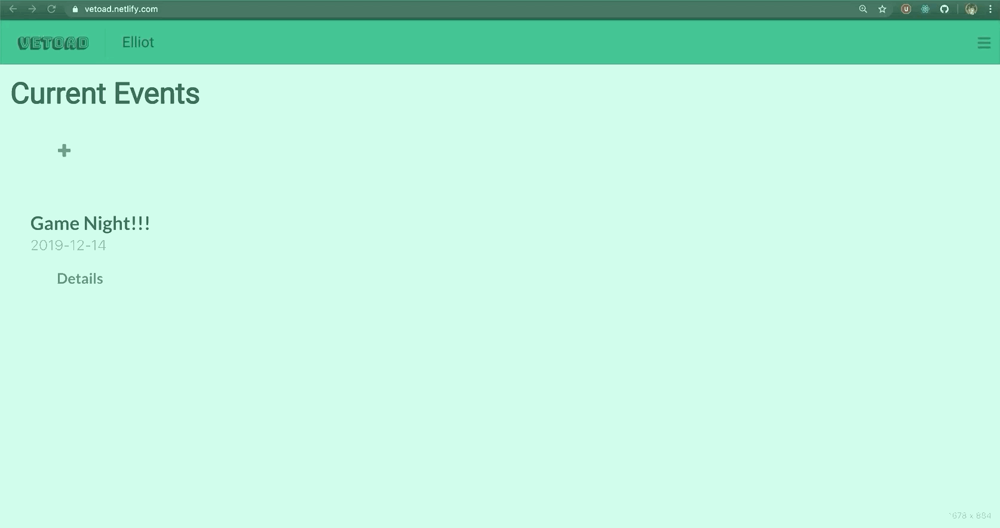

# Vetoad
I come from a large family, and when we are all together making decisions on what to do can be a challenge. Vetoad is a way to navigate the interactions with the indecisive. Users can create events and add other users to their event. They also have the option to give certain users special permissions. 

http://vetoad.netlify.com

<b>Login and Registration</b>
------

Once the user arrives on the launhc page, they have the option to login or register.

<b>How it works</b>
------

Vetoad uses animal emojis as a way to represent the voting system. A Poodle is a vote for something, a Parrot is a vote against something, and a Toad or Vetoad will veto something. The How It Works tab in the side-bar menu will give you all the information you need about the various animal options.

<b>Creating an event</b>
------

A user can create an event by clicking the "+" button upon login. A user can create event, and give other users permissions, such as Vetoad, or the ability to contribute to the event. 

<b>Voting</b>
------
Upon clicking on an active event, a user will be able to vote for or against something by clicking the Poodle or Parrot button.

A user with the ability to Vetoad will be shown an additional Toad button, this button will veto that suggestion.

Contributing to an event would allow a user the ability to add suggestions to be voted on, users with this permission will have a "+" button upon clicking an event.

